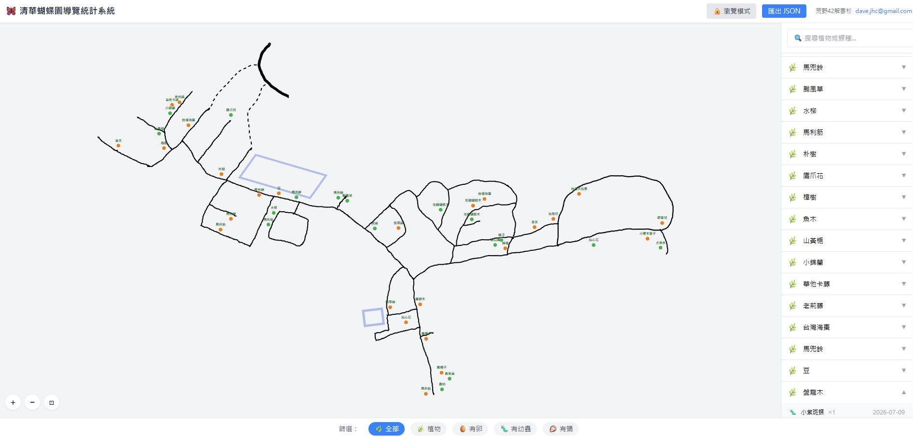

# 🦋 清華蝴蝶園導覽統計系統

> NTHU Butterfly Garden Guide & Statistics System

一個基於 SVG 蝴蝶花園輪廓地圖的互動式生態記錄系統，用於清華大學蝴蝶園的植物與蝴蝶生態觀察管理。



---

## 🌟 功能簡介

- 🌿 **植物標示**：在地圖上標記植物位置，記錄名稱、學名、數量、照片
- 🥚 **蝴蝶卵記錄**：在植物下記錄蝴蝶卵的發現（蝶種、數量、日期、照片）
- 🐛 **幼蟲觀察**：記錄幼蟲的觀察（蝶種、齡期、數量、日期、照片）
- 🦪 **蛹的狀態**：記錄蛹的狀態（蝶種、位置、預計羽化日、照片）
- 📋 **側邊欄管理**：植物列表、搜尋、篩選
- 💾 **資料儲存**：瀏覽器 LocalStorage，支援 JSON 匯出/匯入
- 📸 **照片壓縮**：前端自動壓縮至 800px
- 🔒 **瀏覽模式** / ✏️ **編輯模式** 雙模式切換

---

## 🚀 使用方式

### 一般使用者

直接雙擊 `docs/index.html`，用瀏覽器開啟即可。無需安裝任何軟體。

> 建議瀏覽器：Chrome / Edge / Firefox

### 開發者

```bash
npm install        # 安裝依賴
npm run dev        # 啟動開發伺服器 (http://localhost:5173)
npm run build      # 建置單檔案產出 (docs/index.html)
```

---

## 🛠 技術棧

| 層級 | 技術 |
|------|------|
| 前端框架 | React 18 + TypeScript |
| 建構工具 | Vite 5 |
| CSS | Tailwind CSS 3 |
| 單檔案輸出 | vite-plugin-singlefile |
| 圖片處理 | Canvas API |
| 資料儲存 | LocalStorage |

---

## 📄 授權

本專案採用 [MIT License](LICENSE) 授權。

Copyright © 2026 荒野新竹42解雲杉

---

## 📧 聯絡

- 作者：荒野新竹42解雲杉
- Email：[dave.jhc@gmail.com](mailto:dave.jhc@gmail.com)